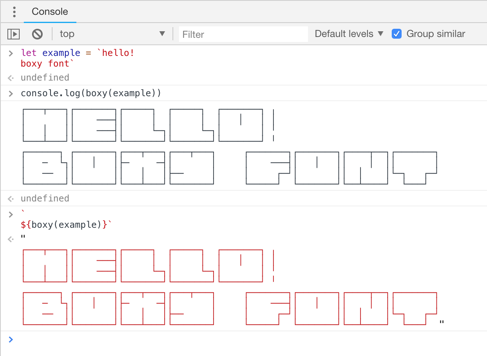
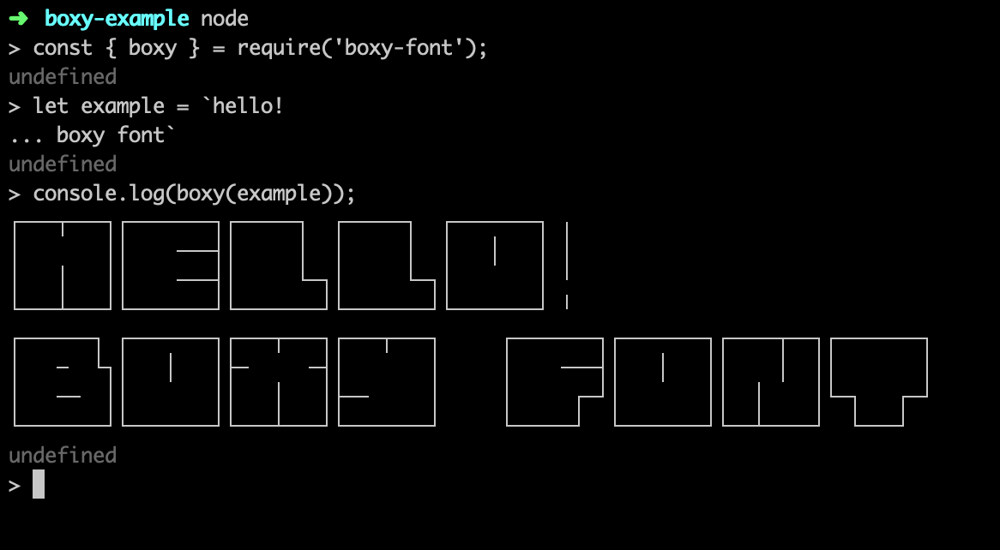

```
┌──────┐ ┌───────┐┌───┬───┐┌───┬───┐     ┌───────┐┌───────┐┌────┬──┐┌───────┐
│   ─  └┐│   │   │├─     ─┤│       │     │    ───┤│   │   ││    │  ││       │
│   ──  ││       ││   │   │├──     │     │     ┌─┘│       ││  │    │└─┐   ┌─┘
└───────┘└───────┘└───┴───┘└───────┘     └─────┘  └───────┘└──┴────┘  └───┘
```

## Overview
Boxy Font is a fancy font with square characters.
It can be used in any monospaced environment.
For example, you can create a terminal banner, print it in the browser developer console,
or use it as a heading in your README.





## Install

```bash
yarn add boxy-font
```

## How to use

### `boxy(value)`

Converts an input string into string of boxy characters.

```js
const { boxy } = require('boxy-font');

const boxyfied = boxy('hello world!');
```  

**Arguments**
- `value` (string): The string to convert.

**Returns**
- (string): The converted string.

### `generateCharsTable()`

Generates the table of all supported characters.

```js
const { generateCharsTable } = require('boxy-font/utils');

console.log(generateCharsTable());
```

**Returns**
- (string): The table as a multi-line string.
